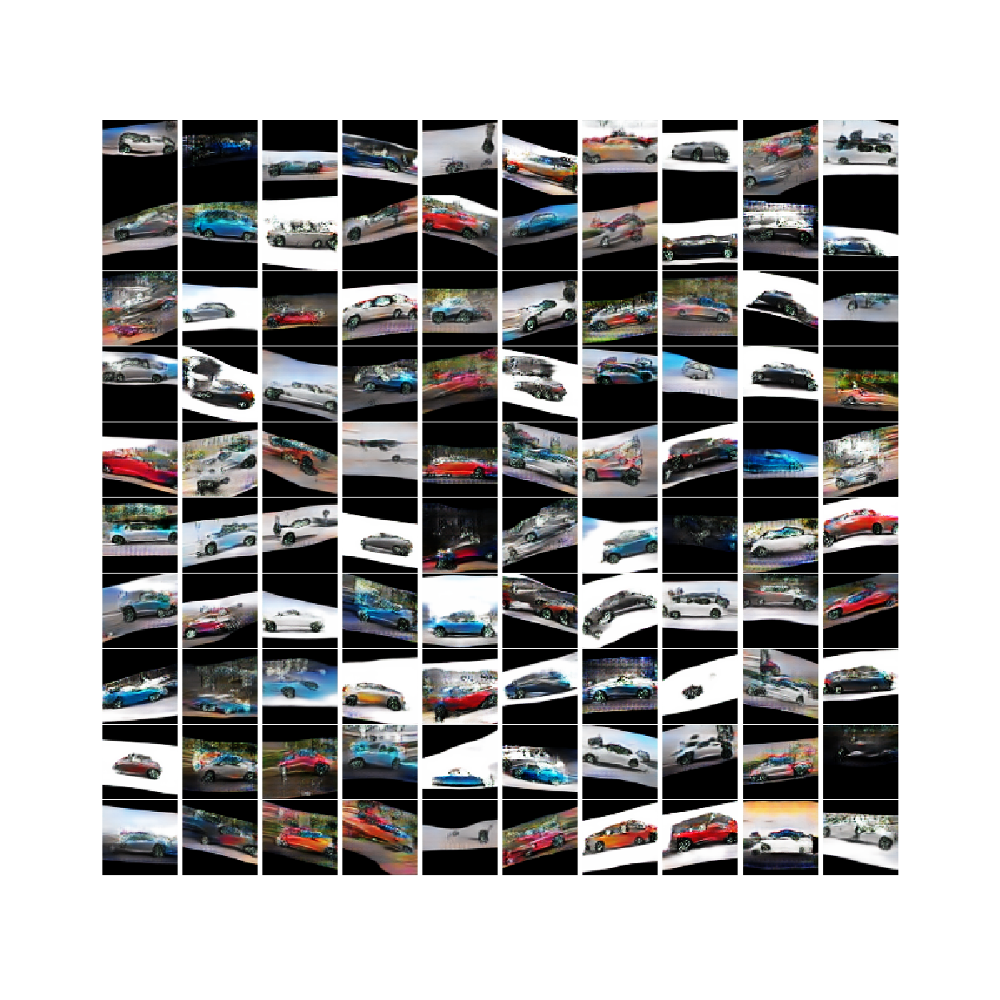
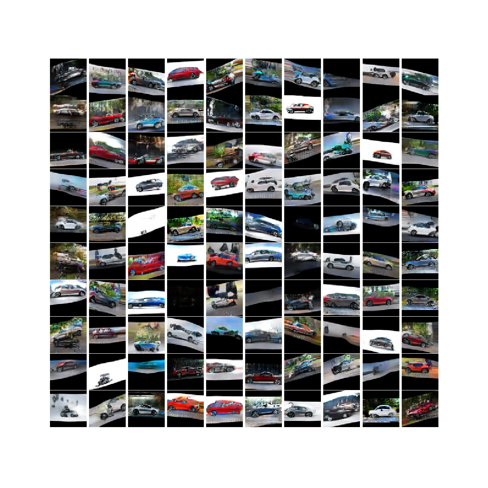
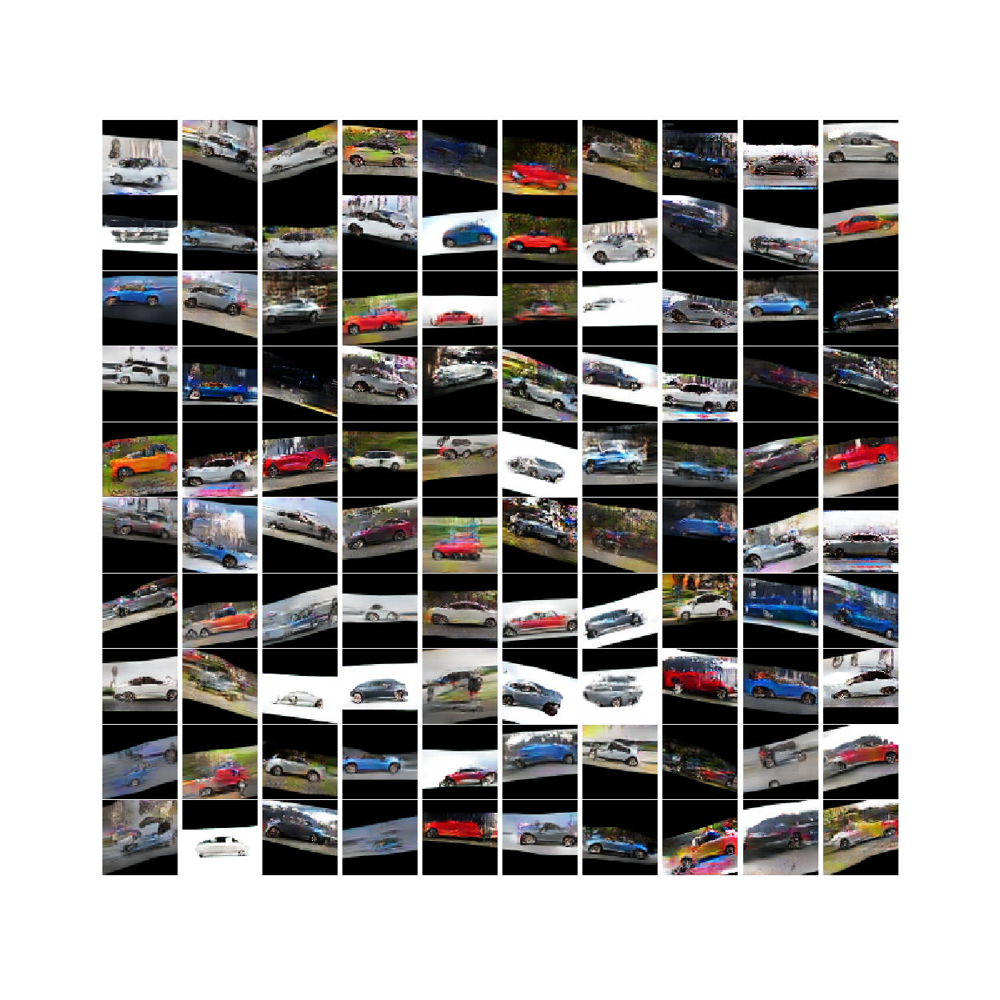

# Generation of Cars Using DC-GAN

* [DCGAN to generate Cars](./DCGAN_v3.ipynb)

* Results

  * Iteration 200
  * 
  * Iteration 400
  * 
  * Iteration 600
  * 

  

## References

* [Keras Implementation of Different GANS](<https://github.com/eriklindernoren/Keras-GAN#gan>)
* [GAN Hacks](<https://github.com/soumith/ganhacks>)
* [Machine Learning Mastery | Keras | CIFAR10 dataset](<https://machinelearningmastery.com/how-to-develop-a-generative-adversarial-network-for-a-cifar-10-small-object-photographs-from-scratch/>)

